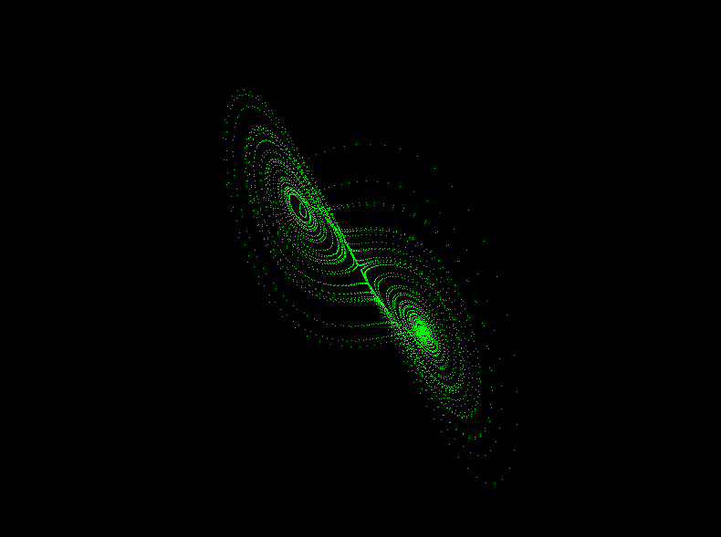

# Lorenz Attractor

>Simple visualization of the Lorenz Attractor in C using library `SDL3/SDL.h`.
---

## How to run?

>There is a "build script" `compile.sh` written in `bash` to compile the code.

---

> Whole program is based on these 3 differential equations.

$$
\dot{x} = \sigma (y - x)
$$

$$
\dot{y} = x(\rho - z) - y
$$

$$
\dot{z} = xy - \beta z
$$

> With parameters of the equations being recommended:

$$
\sigma = 10
$$

$$
\rho = 28
$$

$$
\beta = \frac{8}{3}
$$
